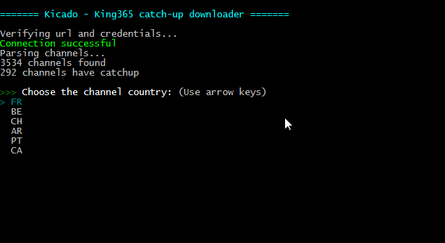

# Kicado
Kicado is a simple downloader for King365TV catch-up programs.



## Features

- Downloads the latest channel list, to identify:
  - the channels offering catchup
  - and their count of archived days
- Downloads the video, according to the user-selected parameters

## Usage

### Choice 1 - Compiled binary (for yo momma)

#### Preparation

Download the latest binary for your OS: [releases](https://github.com/coronawalrus/kicado/releases)

Launch it a first time. A configuration file (`config.json`) will be created.

Edit it to add your credentials.

#### Run

Launch the binary.

Enter the requested parameters.

Enjoy the downloaded video in the `downloads/` folder.

### Choice 2 - With node

#### Preparation

Install node and npm.

Clone this repo.

Install dependencies:

```bash
npm install
```

Run the program a first time:

```bash
node index.js
```

A configuration file (`config.json`) will be created.

Edit it to add your credentials.

#### Run

Run the program:

```bash
node index.js
```

Enter the requested parameters.

Enjoy the downloaded video in the `downloads/` folder.

### Choice 3 - Build you own binary

```bash
npm install
npm run pkg -- .
```

## FAQ

Is it compatible with other IPTV providers?

> I dunno. King365TV uses the Xtream-Codes API, so it should work with another providers using it too. Just try to change the host and port.

I want <insert_something_here> feature !

> Fill an issue, but the feature is very unlikely to happen
>
> or
>
> Propose a pull request

Hey moron, I'm sure your binary will steal my credentials! 

> Build your own, dumbass. Typing two commands won't kill ya. 
>
> A wiseman said: "Don't forget to check the code before compiling, open-source doesn't mean harmless."
>
> This code is clean btw.

